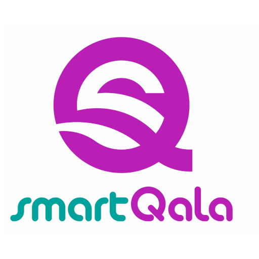
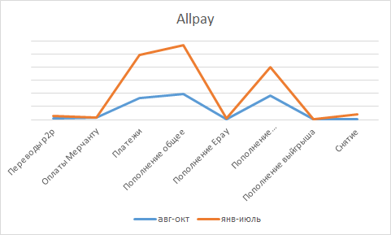

## Новости Softrack

- Новенькие
- Allpay, SQ
- Планы. Задачи
- Что происходит
- Семинары

---

### Новенькие

- Айдар Junior Java Developer
- Тимур Intern Java Developer

---

### SmartQala

Note: Над проектом работали Магжан, Назерке, Али, Акбота, Константин, Всеволод, Руслан и Алина

+++?image=release.jpg&size=auto 100%

---

### SQ

- API Оплата картой без 3DSecure
- Наш продукт, исключая фронтенд
- Выявили недостатки нашего воркфлоу
- Нас ждёт третий Этап

Note: внутренние проблемы и задачи воркфлоу обсудим отдельно дальше

---

### SQ. Постановка задачи

- Особенности договора и прототипа
- Параллельная работа
- Диаграммы и документация
- Swagger. Стандратизация контрактов и сущностей
- Тестирование API

Note: 
- Первый проект, в котором время на рефакторинг включено в договор, и за него платит заказчик. Уже давно думаю о том, что нам нужно менять стратегию продажи IT услуг. Заказчику важно видеть прототип быстро, поэтому важно прорабатывать архитектуру, бизнес процессы и контракты. Потом быстро пишем плохой код, заказчик получает прототип. После чего занимаемся инженерным программированием и рефакторингом.
- На реализацию проекта дали очень сжатые сроки, из-за чего мы все работали одновременно
- Swagger. На самом деле здесь речь идёт о контрактах и документации к API. Появилась задача принять стандарт на ответы и запросы API.
- Тестирование API. Всеволод проделал огромную работу над собой, с момента реализации проекта VKO. Благодаря тестам после релиза все тупо работает, и пользователям API гораздо легче жить. Спасибо Сева!

--- 

### Allpay

- Занимались API для Namba
- Переезжаем из SQL сервера в PostgreSQL
- Пишем PayApp.kz для ЦОН-ов и egov услуг
- Много задач направленны на облегчение поддержки

Note: Падение серверов и отключение света приводит к простою команды. 200 тыс тенге за 5 часов простоя неделю.

---

### Что происходит

- ВКО 115/месяц. Сент-Октябрь: 260. В мае было 90/месяц
- Allpay 30486 с августа, 50871 с января по август. Динамика скачивания приложений аналогична

---

### Планы

- Возможна продажа бэкенда SQ
- Проект СКУД для нового бизнес центра
- ТАИС/Астана-1
- Namba и Киргизия

---

### Технические Задачи

- Серверная и SQLServer
- Недостатки воркфлоу
- CI/CD
- OpenStack облако

---

## Семинары

- Приложеньки на JS
- Workflow и CI/CD
- Luquibase
- GrayLog
